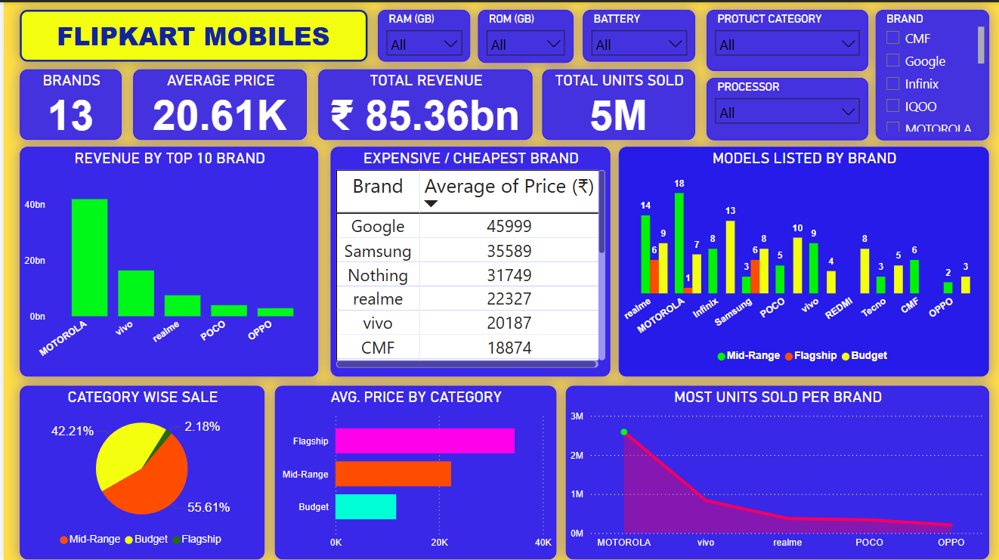

# FLIPKART_MOBILE_ANALYSIS

This is a complete end-to-end data analytics project where I scraped smartphone listings from **Flipkart** using Python, cleaned and transformed the data in **Power BI**, and created a fully interactive dashboard to analyze brand performance, hardware specs, pricing, and product categories.

The goal? To turn raw e-commerce data into actionable insights and develop a real-world data analytics portfolio project.

---

## 🧰 Tech Stack

| Tool            | Use Case                                  |
|-----------------|--------------------------------------------|
| Python          | Web scraping with `requests` + `BeautifulSoup` |
| pandas          | Structuring and saving the data (CSV)      |
| Power BI        | Data cleaning, modeling, dashboard visuals |
| Power Query     | Data transformation in Power BI            |
| DAX             | KPIs and Top-N logic                       |

---

## 📁 Files in This Repository

FLIPKART_MOBILE_ANALYSIS/
├── flipkart_scrapping.ipynb # Python code for scraping Flipkart mobiles
├── flipkart_mobile_data.csv # dataset used in Power BI
├── POWER_BI_DASHBOARD.png # Screenshot of the interactive dashboard
└── README.md # You're reading it honey!

---

## 🧪 Project Features

### 1. Web Scraping with Python
- Extracted real mobile listing data from Flipkart pages.
- Captured:
  - Brand
  - name
  - Price
  - ratings
  - specification

### 2. Power BI Data Cleaning
- Separated composite specs into individual columns (e.g., "8 GB RAM | 128 GB ROM").
- Removed unwanted symbols like "GB", "mAh", "₹".
- Created custom column `Price_Category`:
  - **Budget** (< ₹10,000)
  - **Mid-Range** (₹10K–₹25K)
  - **Flagship** (> ₹25K)

### 3. Dashboard Components
- ✅ KPI Cards (Brands, Revenue, Avg. Price, Units Sold)
- ✅ Top 10 Brands by Revenue
- ✅ Top 10 Models Listed by Brand
- ✅ Top 5 Brands by Units Sold
- ✅ Price Distribution by Category (Pie Chart)
- ✅ Slicers for: RAM, ROM, Battery, Processor, Brand, Price_Category

---

## 📊 Key Insights

- **Motorola** leads both in revenue and units sold.
- **Mid-range** phones dominate the Indian smartphone market (~56%).
- **Google** has the highest average price per phone (~₹45,000).
- **Redmi** has the lowest avg. phone price (~₹11,000).
- **CMF**, **realme**, and **vivo** dominate budget and mid segments.
- **Flagship** phones are the least listed (~2.1% of all listings).

---

## 🎯 What I Learned

- Structured web scraping with Python + BeautifulSoup
- Cleaning messy e-commerce specs in Power Query
- Creating meaningful KPIs and visuals using DAX
- Designing an interactive dashboard with filters
- Applying real-world business thinking in analytics

---

## 📸 Dashboard Preview

> Click to view full image of the dashboard below:

---

## 👋 Connect with Me

- 🔗 LinkedIn:(www.linkedin.com/in/shivanshtiwari1)

---

## If this project helped or inspired you,⭐Star This Repo

 

